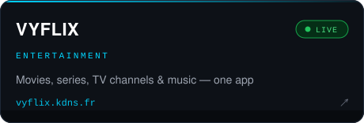
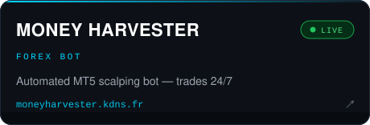
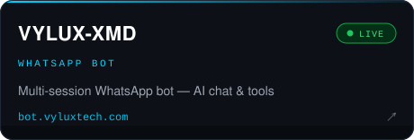
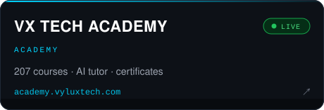
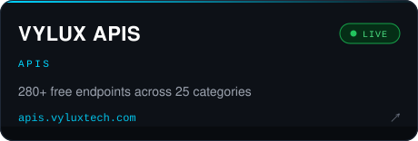
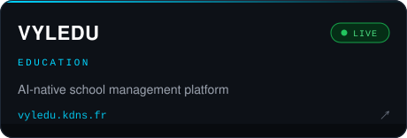

<div align="center">



<br>

[](https://maps.google.com/?q=Kampala,Uganda)
[](https://github.com/VYLUXTECH)
[](https://github.com/VYLUXTECH)
[](https://vyluxtech.com)
[](https://vyluxtech.com)

</div>

---

<table>
<tr>
<td width="70%">

<b>Jayden Mwesigwa</b> — founder of <b>VYLUX TECH</b>, a technology company based in <b>Kampala, Uganda</b> 🇺🇬, and a <b>full-stack developer</b> who turns curiosity into software. I build <b>web apps</b>, <b>REST APIs</b>, <b>automation systems</b>, and <b>developer tooling</b> — shipped, live, and used by real people.

<br><br>

<i>"Engineering Digital Realities." — the motto we build by.</i>

</td>
<td width="30%">

<b>📍 COMPANY FACTS</b>

<b>Location</b> — Kampala, Uganda 🇺🇬 (EAT, UTC+3)<br>
<b>Motto</b> — Engineering Digital Realities<br>
<b>Website</b> — [vyluxtech.com](https://vyluxtech.com)<br>
<b>Email</b> — vyluxtech@gmail.com<br>
<b>Meetings</b> — By appointment in Kampala

</td>
</tr>
</table>

---

## 📦 Products — what we build and run

> Six live products we own and operate — what we sell, we also use every day.

<table>
<tr>
<td align="center" width="50%"><a href="https://vyflix.kdns.fr"></a></td>
<td align="center" width="50%"><a href="https://moneyharvester.kdns.fr"></a></td>
</tr>
<tr>
<td align="center" width="50%"><a href="https://bot.vyluxtech.com"></a></td>
<td align="center" width="50%"><a href="https://academy.vyluxtech.com"></a></td>
</tr>
<tr>
<td align="center" width="50%"><a href="https://apis.vyluxtech.com"></a></td>
<td align="center" width="50%"><a href="https://vyledu.kdns.fr"></a></td>
</tr>
</table>

**Services (8 verticals):** Video Production · Web & Mobile · AI / Machine Learning · Automation & Bots · Cybersecurity · Financial Tech · SaaS · Coding Academy

---

## 📊 GitHub Pulse

<table>
<tr>
<td width="50%"></td>
<td width="50%"></td>
</tr>
</table>

<picture>
  <source media="(prefers-color-scheme: dark)" srcset="dist/github-contribution-grid-snake-dark.svg" />
  <source media="(prefers-color-scheme: light)" srcset="dist/github-contribution-grid-snake.svg" />
  
</picture>

---

## 🧠 Engineering Positioning

```
╔══════════════════════════════════════════════════════════════╗
║  VYLUX TECH // Full-Stack Developer & API Builder            ║
║  Founder & Operator · Jayden Mwesigwa · Kampala, Uganda      ║
║──────────────────────────────────────────────────────────────║
║  ▸ REST API Design & Development   [Node.js / Express]       ║
║  ▸ Full-Stack Web Development      [React / Vite / Tailwind] ║
║  ▸ Scrapers & Automation           [Puppeteer / CDP]         ║
║  ▸ WhatsApp Tooling                [Baileys / XMD]           ║
║  ▸ Linux / Server Infrastructure   [Nginx / Docker / PM2]    ║
║  ▸ Databases                       [MongoDB / MySQL / Redis] ║
║  ▸ Open Source                     [shipped & live]          ║
╚══════════════════════════════════════════════════════════════╝
```

I work across the whole stack — **React** on the front, **Node.js / Python / Go** on the back — at the intersection of **API infrastructure**, **automation**, and **developer tooling**, engineering systems that stay up and do exactly what they're told.

---

## 🛠️ Tech Stack


<table>
<tr>
<td width="38%"></td>
<td width="62%">

<b>Stack at a glance</b><br><br>

Primary: <b>React · TypeScript · Node.js · Python · Go</b><br>
Serving: <b>Nginx · Docker · PM2</b> on Linux<br>
Data: <b>MongoDB · MySQL · Redis</b><br>
Edge: <b>Cloudflare · Vercel</b>

</td>
</tr>
</table>

---

## 🔍 Search Keywords (SEO)

> *This section helps developers and recruiters find this profile.*

Kampala Uganda software engineer · full stack developer Uganda · backend engineer Uganda · React Node.js developer · JavaScript developer Uganda · Node.js developer · REST API builder · WhatsApp bot framework · VYLUX TECH · VYLUX-APIS · VYLUX-XMD · VYLEDU school management system · VYFLIX streaming · MONEY HARVESTER MT5 bot · VYLUX APIS free API hub · VX TECH Academy · open source · automation · cloudflare pages · Nginx · Docker · MongoDB developer · Express.js API · scraper engineer · Jayden Mwesigwa · Uganda software engineer · African tech company

---

## 🤝 Work With Me

- 🌐 **Full-stack builds** — React + Node.js/Express apps, dashboards, portals
- 🧩 **APIs & scrapers** — REST backends, data pipelines, automation
- 🤖 **Bots** — WhatsApp tooling and bot frameworks
- 🛠️ **Open source** — collaboration on the VYLUX TECH ecosystem
- 🏢 **Full projects through VYLUX TECH** — web & mobile apps, AI integrations, cybersecurity audits, video production (from Kampala, delivered worldwide)

If you're building something real and want an engineer who ships — let's talk.

---

## 🔗 Connect

[](https://vyluxtech.com)
[](mailto:vyluxtech@gmail.com)
[](https://github.com/VYLUXTECH)

<div align="center">

⭐ If any of my work has helped you, consider starring a repo — it keeps the builds shipping.

**Powered by VYLUX TECH** · Jayden Mwesigwa · **Kampala, Uganda**


</div>
